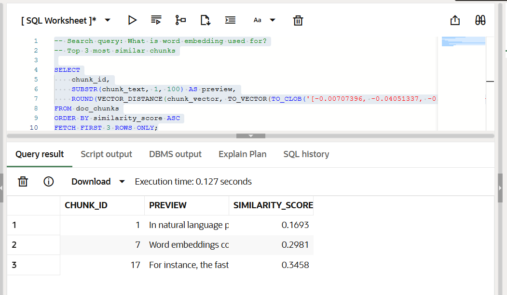
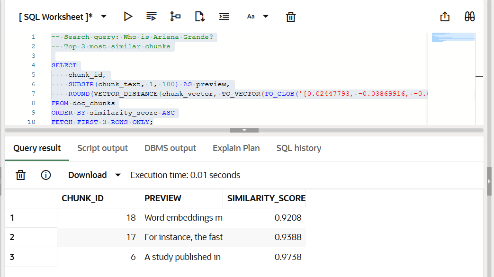

- Just to clarify that the articles array is the same one as the original in the notebook.

## First question: What is word embedding used for?
This makes sense because the article is about word embeddings, so the results are relevant and related to the topic.
- Screenshot: 

## Second question: Word embeddings improve Natural Language Processing
This also makes sense because the results match the idea that word embeddings are used in NLP, so the answers are consistent with the article.

## Third question: Who is Ariana Grande?
This does not make sense because the article is about word embeddings, not about Ariana Grande, so the results are not relevant.
- Screenshot: 